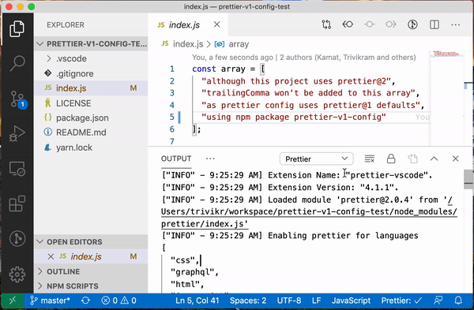

# prettier-v1-config-test

Testing npm package prettier-v1-config

## Steps to test

### In Visual Studio Code

- Clone this repo, and open it in [Visual Studio Code](https://code.visualstudio.com/)
- Install [prettier-vscode](https://marketplace.visualstudio.com/items?itemName=esbenp.prettier-vscode) extension v4.0.0+
- Run `yarn` to install dependencies
- Open [index.js](./index.js), and add trailingComma at the end of array
- Notice that prettier-vscode extension removes the trailingComma when file is saved
- This happens `"trailingComma": "none"` from [prettier-v1-config](https://github.com/trivikr/prettier-v1-config/blob/621215afa7275ce3b2835a10484cd0ab74dfb7c6/index.json#L5) gets preference over `"trailingComma": "es5"` [defined by prettier@2](https://prettier.io/blog/2020/03/21/2.0.0.html#change-default-value-for-trailingcomma-to-es5-6963httpsgithubcomprettierprettierpull6963-by-fiskerhttpsgithubcomfisker)

Screen recording

